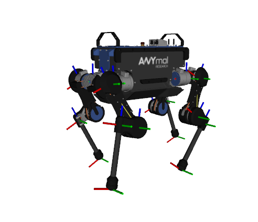

# ANYmal simulation
## Overview

This package contains a simulation of the [ANYmal B robot](https://www.anybotics.com/anymal) developed by [ANYbotics](https://www.anybotics.com).

URDF license : [anymal_b_simple_description](https://github.com/ANYbotics/anymal_b_simple_description)


## Usage

Load the ANYmal description to the ROS parameter server:

    roslaunch anymal_b_simple_description load.launch

To visualize and debug the robot description, start the standalone visualization (note that you have to provide the following additional dependencies: `joint_state_publisher`, `robot_state_publisher`, `rviz`):

    roslaunch anymal_b_simple_description standalone.launch

### Launch files

* **`load.launch`:** Loads the URDF to the parameter server. Meant to be included in higher level launch files.

* **`standalone.launch`:** A standalone launch file that starts RViz and a joint state publisher to debug the description.

## Simulation
```
cd src
catkin_init_workspace
cd ..
catkin_make
source devel/setup.bash
roslaunch --screen anymal_simulator anymal_simulation.launch
```

