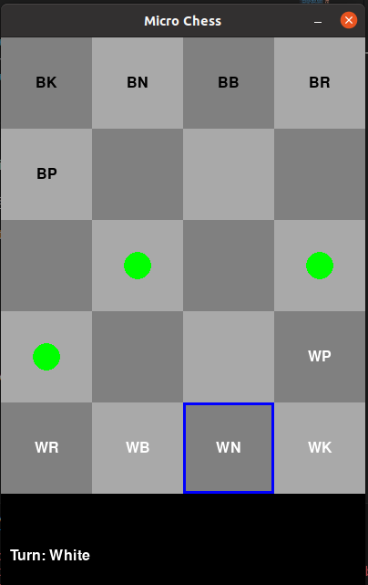
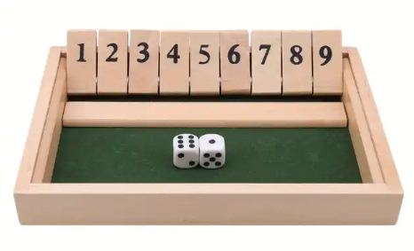
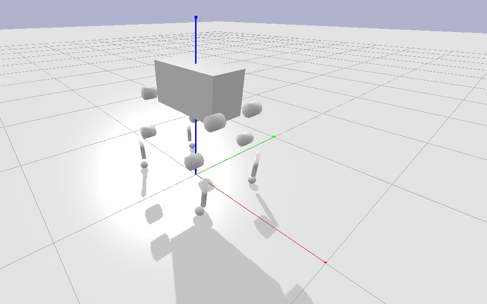
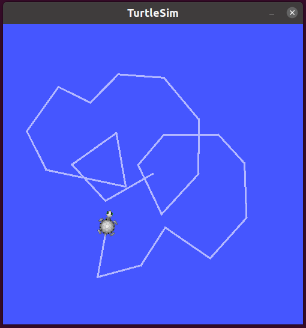
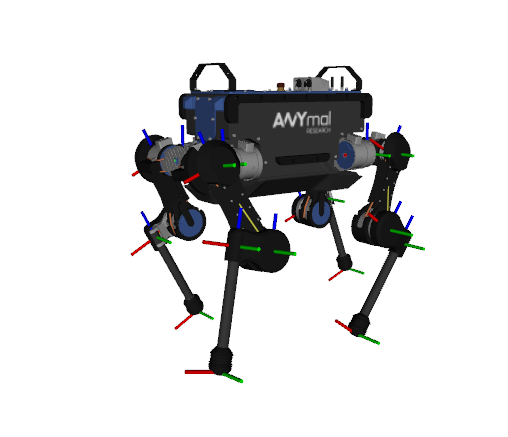

# RL and Robotics Projects

This repository contains my Reinforcement Learning (RL) and robotics projects that explore different simulation environments, RL agents, and robotic platforms. Below is an overview of each project.

## 1. Micro Chess (5x4) Reinforcement Learning

A **micro chess environment** for reinforcement learning, where an agent is trained using **Proximal Policy Optimization (PPO)**. This project features both a command-line interface and a graphical user interface for interacting with the AI, providing options for human vs. AI gameplay. [Read More](micro_chess/README.md)

**Key Features:**
- Custom Micro Chess environment based on OpenAI Gym.
- RL agent trained using Ray RLlib's PPO.
- Action masking for valid chess moves.
- GUI and CLI for playing against AI.
---

## 2. Shut the Box Game

A **Shut the Box** simulation for reinforcement learning. This project models the classic probability game and allows RL agents to learn optimal strategies through gameplay. The goal is to train an agent that can achieve high success rates based on the dynamics of the game. [Read More](shut_the_box/README.md)

**Key Features:**
- Reinforcement learning agent trained on Shut the Box.
- Simulation of probability-based decisions.
- Analysis of winning strategies based on game state.

---

## 3. Quadruped Gait Analysis

This project aims to simulate and analyze the gait of **quadruped robots** using the PyBullet simulation environment and ROS for data handling. It features ROS nodes for publishing and subscribing to joint states, allowing for real-time analysis of the robot's movement, stability, and gait efficiency. [Read More](quadruped_analysis/README.md)

**Key Features:**
- Simulates quadruped robots using PyBullet.
- ROS publisher and subscriber nodes for joint states.
- Real-time plotting of joint positions for gait analysis.
- Extendable to RViz for enhanced robot visualization.

---

## 4. TurtleSim Shape Drawer

This project demonstrates the use of ROS in controlling a simulated turtle robot using **TurtleSim**. The turtle automatically draws various geometric shapes, and users can manually control the robot via a keyboard teleoperation interface. [Read More](turtlesim_drawer/README.md)

**Key Features:**
- Automatic drawing of shapes (square, circle, triangle) in TurtleSim.
- ROS-based teleoperation for manual control via keyboard.

---

## 5. ANYmal Simulation

This project simulates the **ANYmal B robot**, a quadruped robot developed by [ANYbotics](https://www.anybotics.com/anymal). It provides a full ROS package for visualizing and simulating the robot, with URDF descriptions and launch files for parameter loading and visualization in RViz. The simulation environment is powered by Gazebo, and joystick control is available through the ROS network for manual interaction with the robot. [Read More](ANYmal_simulation/README.md)

**Key Features:**
- Full robot description in URDF.
- RViz standalone visualizer for debugging.
- Gazebo-based simulation environment for ANYmal robot movements.
- Joystick control via ROS network for manual operation.
---

Feel free to explore each project in detail using the provided links!
