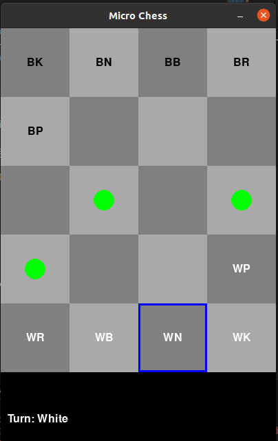

# Micro Chess (5x4) Reinforcement Learning Project

## Project Overview

This project implements a **Micro Chess** environment (a simplified 5x4 chess variant) and trains an RL agent using **Proximal Policy Optimization (PPO)**. The goal is to create an AI that can effectively play Micro Chess by learning optimal strategies through reinforcement learning. This project features a command-line interface and a GUI for users to interact with the AI.


### Key Features
- **Custom 5x4 Micro Chess environment** based on OpenAI Gym.
- **RL agent** trained with PPO from Ray RLlib.
- **Action masking** for valid moves.
- **Human vs. AI mode** with a CLI interface.
- **Graphical User Interface (GUI)** for visualizing the chess game.
- **Reward function** based on advanced reinforcement learning strategies as described in the paper [Proximal Policy Optimization with Clipped Penalty](https://arxiv.org/pdf/2112.13666).

---

## Reward Function

The reward function is inspired by the paper "[Proximal Policy Optimization with Clipped Penalty](https://arxiv.org/pdf/2112.13666)," focusing on providing the agent with meaningful feedback to improve learning efficiency. Rewards are assigned based on:

- **Piece Capture**: Large positive reward for capturing the opponent’s King, smaller rewards for other pieces.
- **Legal Moves**: No penalty for valid moves.
- **Illegal Moves**: Penalty for attempting moves that break the rules of chess or leave the board boundaries.
- **End Game**: A significant positive reward for winning (capturing the opponent's King), and a large penalty for losing.

---

## Training the Agent

The agent is trained using **Proximal Policy Optimization (PPO)**. PPO is an advanced RL algorithm that strikes a balance between exploration and exploitation by ensuring that updates do not drastically change the policy.

### Training Configuration:
- **Learning Rate**: `1e-4`
- **Gamma (Discount Factor)**: `0.99`
- **Training Batch Size**: `1000`
- **Entropy Coefficient**: `0.01`
- **Clip Parameter**: `0.2`
- **Framework**: PyTorch

Below is an example of the output during the training process:

```
Iteration 0: episode_reward_mean=0.5
Checkpoint saved at checkpoints/micro_chess/checkpoint_0
Iteration 10: episode_reward_mean=12.3
Checkpoint saved at checkpoints/micro_chess/checkpoint_10
Iteration 50: episode_reward_mean=45.6
Checkpoint saved at checkpoints/micro_chess/checkpoint_50
...
Training completed. Final checkpoint saved at checkpoints/micro_chess/checkpoint_1000
```

The model progressively learns better strategies as it moves from random to optimized gameplay.

---

## Environment

The environment consists of a **5x4 chess board**, with simplified rules compared to traditional chess. The custom environment includes both a **command-line interface** and a **Graphical User Interface (GUI)** to visualize the game.


### GUI

Here’s a preview of the GUI environment:



The GUI allows users to interact with the agent through a user-friendly visual interface, displaying board state, moves, and game status.

---

## Sample Results

Once trained, the agent can play against a human player or another agent. Below is a sample output from a human vs. AI game in the command-line interface:

```
Initial Board:
  0 1 2 3
0 K N B R
1 P * * *
2 * * * *
3 * * * p
4 r b n k
```

---

### AI Move:
- **AI moves Pawn** from (3,3) to (2,3).

```
  0 1 2 3
0 K N B R
1 * * * *
2 P * * *
3 * * * p
4 r b n k
```

---

### Your Move:
- **You move Pawn** from (2,0) to (3,3).

```
  0 1 2 3
0 K N B R
1 * * * *
2 P * * p
3 * * * *
4 r b n k
```

---

### AI Move:
- **AI moves Knight** from (4,2) to (2,2).

```
  0 1 2 3
0 K * B R
1 * * * *
2 P * N p
3 * * * *
4 r b n k
```

---

### Your Move:
- **You move King** from (3,0) to (3,3).

```
  0 1 2 3
0 K * B R
1 * * * *
2 P * N p
3 * * * k
4 r b n *
```

---

### AI Move:
- **AI moves Bishop** from (4,1) to (1,1).

```
  0 1 2 3
0 K * * R
1 * B * *
2 P * N p
3 * * * k
4 r b n *
```

---

### Your Move:
- **You move Pawn** from (2,0) to (1,3).

```
  0 1 2 3
0 K * * R
1 * B * p
2 P * N *
3 * * * k
4 r b n *
```

---

### AI Move:
- **AI moves Rook** from (4,0) to (1,3).

```
  0 1 2 3
0 K * * *
1 * B * R
2 P * N *
3 * * * k
4 r b n *
```

---

### Your Move:
- **You move King** from (3,3) to (3,2).

```
  0 1 2 3
0 K * * *
1 * B * R
2 P * N *
3 * * k *
4 r b n *
```

---

### AI Move:
- **AI moves Knight** from (4,2) to (4,3).

```
  0 1 2 3
0 K * * *
1 * B * R
2 P * * *
3 * * k *
4 r b n N
```

---

### Your Move:
- **You move Bishop** from (1,2) to (3,0).

```
  0 1 2 3
0 K * * *
1 * B * R
2 P * * *
3 b * k *
4 r * n N
```

---

### AI Move:
- **AI moves King** from (4,3) to (1,0).

```
  0 1 2 3
0 * * * *
1 K B * R
2 P * * *
3 b * k *
4 r * n N
```

---

### Your Move:
- **You move Bishop** from (3,1) to (2,1).

```
  0 1 2 3
0 * * * *
1 K B * R
2 P b * *
3 * * k *
4 r * n N
```
---

### AI Move:
- **AI moves King** from (1,0) to (0,1).

```
  0 1 2 3
0 * K * *
1 * B * R
2 P b * *
3 * * k *
4 r * n N
```

---

### Your Move:
- **You move Rook** from (4,1) to (3,0).

```
  0 1 2 3
0 * K * *
1 * B * R
2 P b * *
3 * * k *
4 * r n N
```

---

### AI Move:
- **AI moves Rook** from (3,3) to (3,2) (Checkmate).

```
  0 1 2 3
0 * K * *
1 * B * *
2 P b * *
3 * * k R
4 * r n N
```

---

**Checkmate!**  
The AI delivers a checkmate by positioning the Rook on row 3, column 2, trapping your King with no possible escape.

---
