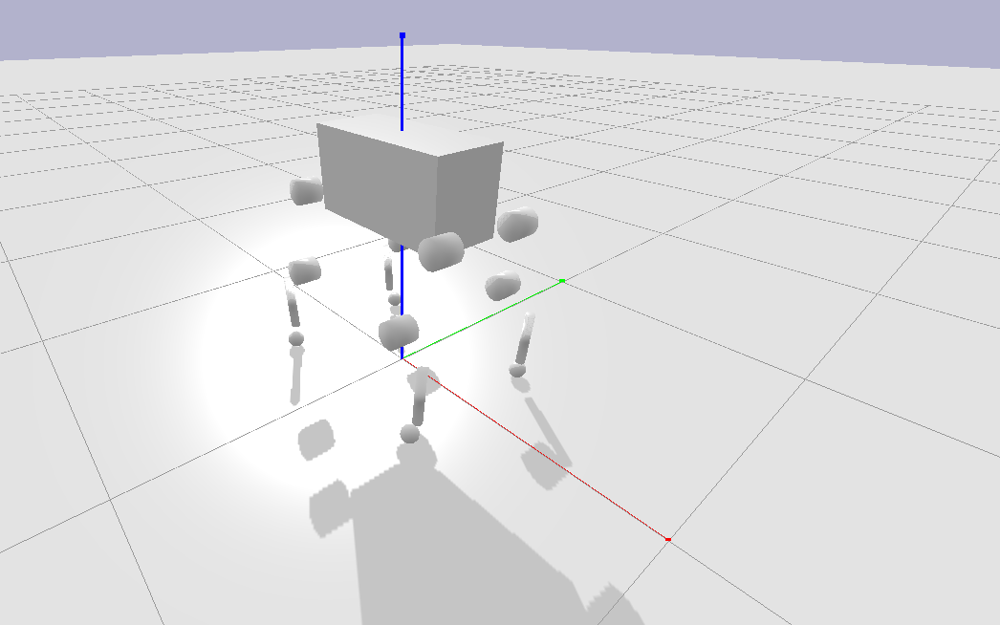
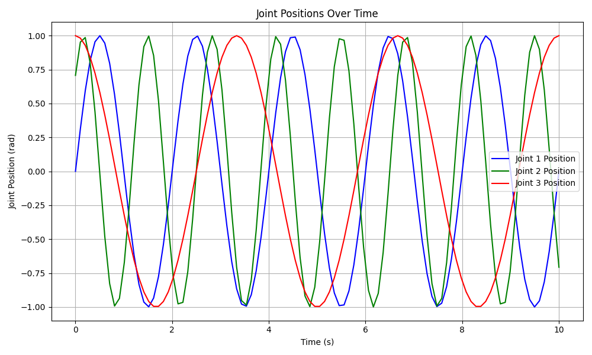

# **Quadruped Simulation and ROS Analysis Project**

## **Overview**

This project aims to simulate a realistic quadruped robot using a simulation environment (PyBullet), publish relevant sensor and state data via ROS, and create a subscriber node that analyzes the data to extract meaningful insights such as gait patterns, stability, and energy consumption.

---

## **Project Structure**

The project is organized as a ROS package for ease of modularity and integration with other ROS components.

### **Key Components:**

1. **Simulation Environment:**
   - Simulates a quadruped robot using PyBullet, a physics simulation engine.
   - Joint states (positions, velocities, efforts) are extracted and published to ROS topics.
   
2. **ROS Publisher Node:**
   - Publishes joint state data to `/quadruped/joint_states`.
   
3. **ROS Subscriber Node:**
   - Subscribes to joint state data and performs gait analysis.
   
4. **Visualization:**
   - Uses `matplotlib` for real-time plotting of joint positions.
   - Further extendable to use RViz for robot visualization.

---

## **Setup Instructions**

### **1. System Requirements**

- Ubuntu 20.04 (or similar Linux distribution)
- ROS Noetic
- Python 3.x

### **2. Install Dependencies**

Install ROS and the necessary ROS packages:
```bash
sudo apt update
sudo apt install ros-noetic-ros-base python3-rosdep python3-rosinstall python3-rosinstall-generator python3-wstool build-essential
```

Ensure ROS is properly initialized:
```bash
sudo rosdep init
rosdep update
```

Create a workspace if you don’t already have one:
```bash
mkdir -p ~/catkin_ws/src
cd ~/catkin_ws/
catkin_make
```

Source the workspace:
```bash
source devel/setup.bash
```

### **3. Install Project Dependencies**

Install the following Python packages for PyBullet and ROS:

```bash
pip install pybullet rospy std_msgs sensor_msgs matplotlib
```

---

## **Project Setup**

### **1. Clone the Repository**

Navigate to your catkin workspace and clone the repository into the `src` directory:

```bash
cd ~/catkin_ws/src
git clone https://github.com/yourusername/quadruped_analysis.git
```

### **2. Build the ROS Package**

Once the project is cloned, build the package:

```bash
cd ~/catkin_ws
catkin_make
```

Source your workspace:

```bash
source devel/setup.bash
```

---

## **Running the Simulation**

### **1. Start the ROS Core**

Make sure the ROS master is running:

```bash
roscore
```

### **2. Launch the Simulation**

The simulation will be launched via a launch file that runs both the publisher and subscriber nodes:

```bash
roslaunch quadruped_analysis simulation.launch
```

This will:
1. Start the PyBullet-based quadruped simulation.
2. Publish the quadruped's joint states to `/quadruped/joint_states`.
3. Analyze the joint states to calculate gait patterns and visualize joint positions in real-time.

---

## **ROS Nodes**

### **Publisher Node:**

The publisher node, `quadruped_simulation.py`, runs the PyBullet simulation and publishes the quadruped's joint states (positions, velocities, efforts) to the topic `/quadruped/joint_states`.



### **Subscriber Node:**

The subscriber node, `gait_analysis_subscriber.py`, subscribes to the `/quadruped/joint_states` topic and performs gait analysis by calculating the frequency of joint oscillations using Fast Fourier Transform (FFT). It also plots the joint positions in real-time using `matplotlib`.

   

---

## **Project Directory Structure**

```bash
quadruped_analysis/
├── CMakeLists.txt                      # CMake build configuration
├── package.xml                         # ROS package information
├── launch/
│   └── simulation.launch               # Launch file for the simulation
├── scripts/
│   ├── quadruped_simulation.py         # Publisher node (simulation)
│   └── gait_analysis_subscriber.py     # Subscriber node (data analysis)
├── urdf/
│   ├── anymal.urdf                  # URDF model of the quadruped robot
    └── plane.urdf                  # URDF model of the plane
```

---

## **Features**

1. **Quadruped Simulation (PyBullet):**
   - Simulates a quadruped robot using the PyBullet physics engine.
   - Joint states (position, velocity, effort) are extracted and published to ROS topics.

2. **Gait Analysis (ROS Subscriber Node):**
   - Subscribes to the joint states of the quadruped.
   - Performs FFT to calculate joint oscillation frequencies, which can be used to analyze gait patterns.
   - Visualizes joint positions in real-time using `matplotlib`.

---

## **Additional Features**

### **Data Logging with rosbag**

To log the joint state data for offline analysis:

```bash
rosbag record /quadruped/joint_states
```

### **RViz for Visualization**

You can visualize the quadruped's joint states in ROS’s RViz tool by creating a custom visualization node that subscribes to the joint state data and displays it.

