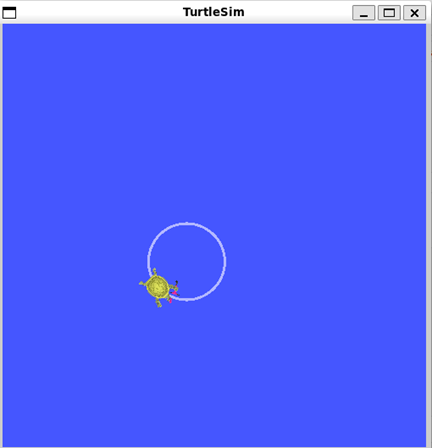

# TurtleSim Drawer


## Overview

The **TurtleSim Drawer** is a ROS (Robot Operating System) package designed to control the [TurtleSim](http://wiki.ros.org/turtlesim) simulator to draw various geometric shapes such as squares, circles, and triangles. Additionally, it includes an optional teleoperation node that allows manual control of the turtle using keyboard inputs.


## Features

- **Automated Shape Drawing:**
  - Draws squares, circles, and equilateral triangles automatically.
  - Easily extendable to include more shapes.
  
- **Manual Teleoperation:**
  - Control the turtle using keyboard inputs (WASD keys).
  - Override automated commands for manual control.

- **Configurable Parameters:**
  - Customize shape dimensions (e.g., side lengths, radii) via YAML configuration files.
  
- **ROS Integration:**
  - Utilizes ROS publishers and subscribers for communication.
  - Launch files to streamline the startup process.

## Prerequisites

- **Operating System:** Ubuntu 20.04 (Focal Fossa)
- **ROS Distribution:** ROS Noetic Ninjemys

Ensure you have ROS Noetic installed on your system. If not, follow the [official ROS Noetic installation guide](http://wiki.ros.org/noetic/Installation/Ubuntu).

## Installation

### 1. Setup Catkin Workspace

If you don't already have a Catkin workspace, create one:

```bash
mkdir -p ~/catkin_ws/src
cd ~/catkin_ws/src
catkin_init_workspace
cd ~/catkin_ws
catkin_make
```

### 2. Clone the Package

Navigate to the `src` directory of your Catkin workspace and clone the `turtlesim_drawer` package.

### 3. Install Dependencies

Ensure all necessary ROS packages are installed:

```bash
sudo apt-get update
sudo apt-get install ros-noetic-turtlesim
```

### 4. Build the Package

Navigate back to the root of your Catkin workspace and build:

```bash
cd ~/catkin_ws
catkin_make
```

### 5. Source the Workspace

Source the workspace to overlay the newly built package:

```bash
source devel/setup.bash
```

To automatically source your workspace in every new terminal session, add the following line to your `~/.bashrc`:

```bash
echo "source ~/catkin_ws/devel/setup.bash" >> ~/.bashrc
source ~/.bashrc
```

## Project Structure

```
turtlesim_drawer/
├── CMakeLists.txt
├── package.xml
├── launch/
│   ├── draw_shapes.launch
│   └── teleop_keyboard.launch
├── scripts/
│   ├── draw_shapes.py
│   └── teleop_keyboard.py
└── config/
    └── shapes.yaml
```

- **CMakeLists.txt:** Build configuration file.
- **package.xml:** Package manifest.
- **launch/:** Contains launch files to start multiple nodes.
- **scripts/:** Contains executable Python scripts for different nodes.
- **config/:** Contains configuration files like YAML for parameters.

## Usage

### Launching the Shape Drawer

To start the TurtleSim simulator and the automated shape drawer node:

```bash
roslaunch turtlesim_drawer draw_shapes.launch
```

This command will:

1. Start the TurtleSim node.
2. Launch the `shape_drawer` node, which will automatically draw a square, circle, and triangle in sequence.



### Using Teleoperation

If you wish to manually control the turtle using the keyboard, you can use the teleoperation node.

#### 1. Launch Teleoperation

In a new terminal, run:

```bash
roslaunch turtlesim_drawer teleop_keyboard.launch
```

#### 2. Control the Turtle

- **W:** Move forward.
- **S:** Move backward.
- **A:** Rotate left (counter-clockwise).
- **D:** Rotate right (clockwise).
- **Q:** Quit teleoperation.

**Example:**

```bash
rosrun turtlesim_drawer teleop_keyboard.py
```

## Troubleshooting

1. **ROS Master Not Running:**
   - **Issue:** Nodes cannot communicate.
   - **Solution:** Ensure `roscore` is running. However, using launch files should handle this automatically.
     ```bash
     roscore
     ```

2. **Permission Denied for Scripts:**
   - **Issue:** Unable to execute Python scripts.
   - **Solution:** Make scripts executable.
     ```bash
     chmod +x ~/catkin_ws/src/turtlesim_drawer/scripts/*.py
     ```

3. **Incorrect Topic Names:**
   - **Issue:** Nodes not communicating as expected.
   - **Solution:** Verify topic names using `rostopic list` and ensure scripts use the correct names.

### Checking Active Topics

Use the following commands to verify active topics and messages:

- **List all topics:**
  ```bash
  rostopic list
  ```

- **Echo a specific topic:**
  ```bash
  rostopic echo /turtle1/cmd_vel
  ```

- **Check node connectivity:**
  ```bash
  rosnode list
  ```
